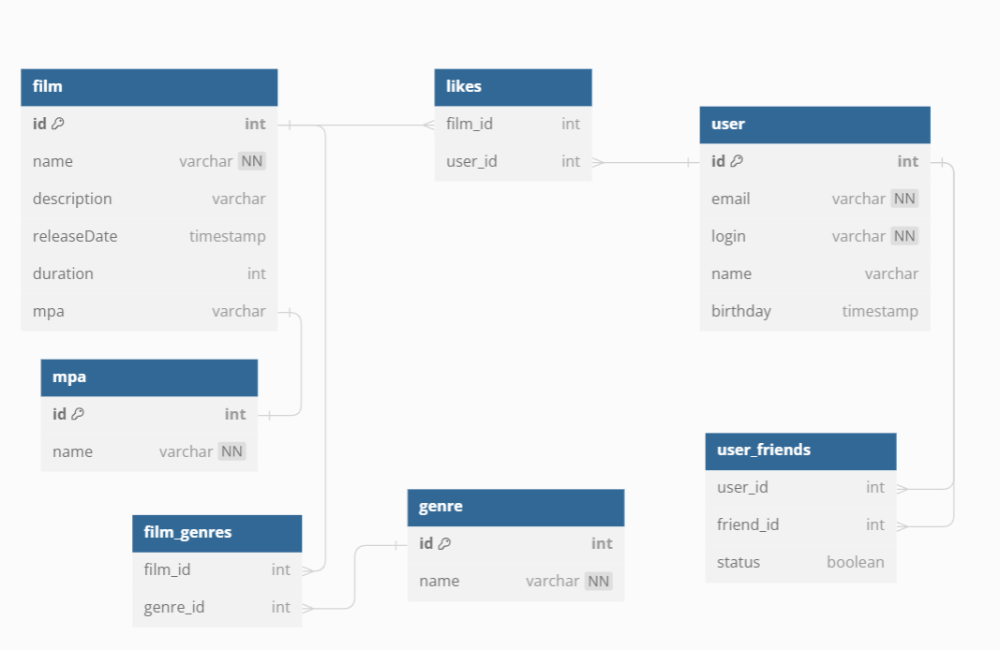

# java-filmorate

### Схема БД
<picture>
    <source media="(prefers-color-scheme: dark)" srcset="src/main/resources/NewBD.png">
    
</picture>

### таблицы:
```
1 - USERS - информация по пользователю, PK - USER_ID.
2 - FRIENDS - информация по списку друзей.
USER_ID и FRIEND_USER_ID являются FK для USERS(USER_ID).
Поле CONFIRMED сообщает: добавил ли другой пользователь, данного в друзья.
3 - FILMS - список фильмов, PK - FILM_ID, FK - MPA_ID.
4 - LIKES - список лайков фильма. FK - FILM_ID, USER_ID.
5 - MPA - справочник ретинга фильма. PK - MPA_ID.
6 - FILM_GENRES - Талица для связи "многие ко многим", чтобы привязывать одному фильму несколько жанров. FK - FILM_ID, GENRE_ID.
7 - GENRES - справочник жанров фильма. Наполнить сразу. PK - GENRE_ID.
8 - REVIEWS - Таблица с отзывами на фильмы. Имеет связи с таблицами USERS и FILMS.
9 - REVIEW_LIKES - Таблица с лайками на отзывы фильма. Имеет связи с таблицами USERS и REVIEWS.
10 - REVIEW_DISLIKES - Таблица с дизлайками на отзывы фильма. Имеет связи с таблицами USERS и REVIEWS.
11 - EVENTS - Таблица событий пользователя. Имеет связь many to one с таблицей USERS

```